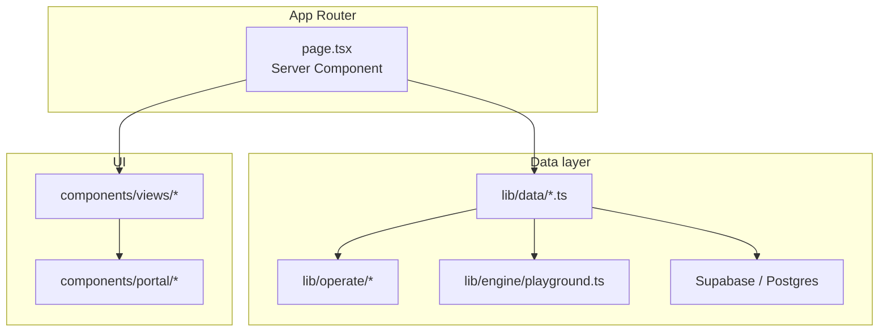

# Amakai

Monorepo for the Amakai marketing site and client portal — two separate Next.js apps that share UI and configuration.

## Structure

```
apps/
  landing/          Marketing site (amakai.com)
  portal/           Client portal (portal.amakai.com)
    app/              Next.js App Router routes
    components/
      views/          Presentational page UI (no data fetching)
      design/         Workflow editor, canvas, and design hub UI
      operate/        Execution detail sheets, operate widgets
      portal/         Shared portal widgets (metrics, status badges, …)
      auth/           Sign-in / sign-up
    lib/
      domain/         TypeScript domain types (API contract)
      data/           Async data accessors ← backend swap point
      operate/          Logs, monitoring, production run insights
      engine/           Playground / production execution engine
      design/           Workflow canvas layout, graph helpers, editor types
      actions/          Server Actions (workflows, tables, production, operate)
      auth/             Auth helpers
    hooks/            Client hooks (editor state, auto-save, testing)
    utils/supabase/   Supabase browser/server clients + session proxy
packages/
  shared/           UI components, theme, and cross-app config
docs/
  SDLC.md             Product requirements and system architecture
  Portal_Guide.md     Portal routes, lifecycle, and agent reference
  Workflow_Nodes_Reference.md
```

## Scripts

From the repo root:

- `npm run dev:landing` — landing site at [http://localhost:3000](http://localhost:3000)
- `npm run dev:portal` — portal at [http://localhost:3001](http://localhost:3001)
- `npm run build:landing` / `npm run build:portal` — production builds
- `npm run lint` — lint all workspaces

Run both apps in separate terminals during local development.

## Environment

Copy [apps/portal/.env.example](apps/portal/.env.example) to `apps/portal/.env.local` and fill in Supabase keys. The portal proxy requires env vars in the **app directory**, not only the repo root.

| Variable | App | Purpose |
|----------|-----|---------|
| `NEXT_PUBLIC_SUPABASE_URL` | Portal | Supabase project URL |
| `NEXT_PUBLIC_SUPABASE_PUBLISHABLE_KEY` | Portal | Browser-safe API key |
| `SUPABASE_SECRET_KEY` | Portal | Server-only admin tasks (optional until needed) |
| `NEXT_PUBLIC_SITE_URL` | Each app | Public URL of that deploy |
| `NEXT_PUBLIC_LANDING_URL` | Both | Cross-link to marketing site |
| `NEXT_PUBLIC_PORTAL_URL` | Both | Cross-link to portal |

See [.env.example](.env.example) for auth redirect URL notes. Do not commit `.env` or `.env.local`.

## Deployment

Deploy each app as its own project (e.g. two Vercel projects from the same repo):

| App | Root directory | Example domain |
|-----|----------------|----------------|
| Landing | `apps/landing` | `https://amakai.com` |
| Portal | `apps/portal` | `https://portal.amakai.com` |

Local dev defaults to `localhost:3000` (landing) and `localhost:3001` (portal) via `NEXT_PUBLIC_APP` in each app's `next.config.ts`. Both apps load env from the monorepo root via `loadEnvConfig` in `next.config.ts`, but **portal auth also requires** `apps/portal/.env.local`.

---

## Portal architecture

The portal uses a **thin page → data accessor → view** pattern. Supabase backs auth, workflow drafts, tables, deployments, and production runs. Views stay presentational; all fetching lives in `lib/data/` or Server Actions.



**Detailed docs:** [docs/Portal_Guide.md](docs/Portal_Guide.md) · [apps/portal/lib/data/README.md](apps/portal/lib/data/README.md)

### Layer rules

| Layer | Location | Responsibility |
|-------|----------|----------------|
| **Domain** | `lib/domain/` | Pure types. No React, no Supabase. |
| **Data** | `lib/data/` | Async functions pages call. **Only layer that talks to DB.** |
| **Operate** | `lib/operate/` | Log grouping, monitoring aggregation, retention constants |
| **Engine** | `lib/engine/` | Playground validation and production run execution |
| **Pages** | `app/(app)/**/page.tsx` | Fetch via accessors, pass props to views |
| **Views** | `components/views/` | Presentational; client state for filters/sheets only |
| **Auth** | `utils/supabase/`, `middleware.ts` | Session refresh and OAuth (live) |

### Portal routes (implemented)

| Section | Routes | Status |
|---------|--------|--------|
| Dashboard | `/` | Live workflows + recent production runs |
| Production | `/production/runs`, `/production/history` | Run deployed workflows; history with trigger input |
| Design | `/design/workflows`, `/design/workflow-editor`, `/design/tables`, `/design/testing` | Supabase drafts; playground testing |
| Operate | `/operate/live-workflows`, `/operate/logs` | Per-workflow monitoring/executions; grouped logs + alerts |
| Resources | `/resources/*` | Stub UI |
| Admin, Community, Settings | `/admin/*`, `/community`, `/settings` | Stub UI |
| Auth | `/login`, `/signup`, `/auth/callback` | Supabase Auth |

Deploy is **not** a top-level nav section — deploy from the workflow editor to production (single live target, overwrite on redeploy).

### Design / workflow editor

| Route | Purpose |
|-------|---------|
| `/design/workflows` | List, create, duplicate, delete workflows |
| `/design/workflow-editor?id=<uuid>` | Canvas editor |
| `/design/testing` | Playground runs with trigger payloads |

Editor URL params: `?panel=components|templates|ai` opens sheets on load.

### Database

Apply migrations in `supabase/migrations/` before using save/deploy/production runs. See the migration table in [apps/portal/lib/data/README.md](apps/portal/lib/data/README.md).

Production runs use `workflow_executions` (20 runs retained per workflow). Logs, monitoring, and executions all read from this table.

Requirements map to [docs/SDLC.md](docs/SDLC.md) section 3.

---

## Backend guide (for AI agents)

### Done

- **Auth** — Supabase (Google, GitHub, email/password); [apps/portal/middleware.ts](apps/portal/middleware.ts) + [utils/supabase/middleware.ts](apps/portal/utils/supabase/middleware.ts)
- **Workflows** — drafts, save, deploy, duplicate; RLS on user-owned rows
- **Data tables** — schema + row editor
- **Production runs** — `startProductionRun`, logs, monitoring, retention
- **Playground engine** — in-process validation and production execution scaffold

### Next (not in repo yet)

Per SDLC §7–10: distributed workflow engine, AI planning service, org tenancy, Resources/Admin backends.

### Agent constraints

- Read [docs/Portal_Guide.md](docs/Portal_Guide.md), [apps/portal/lib/data/README.md](apps/portal/lib/data/README.md), and [docs/SDLC.md](docs/SDLC.md) before changing portal data flow.
- Read Next.js guides in `node_modules/next/dist/docs/` (Next.js 16).
- Shared UI in `packages/shared`; portal UI in `apps/portal/components/`.
- Minimize scope: one accessor or route at a time.

### Verification checklist

After wiring a feature to Supabase:

- [ ] RLS policies tested for authenticated access
- [ ] Data accessors return existing domain types
- [ ] `npm run build:portal` passes
- [ ] Auth middleware refreshes sessions on protected routes; inbound `/api/webhooks/*` remains public
