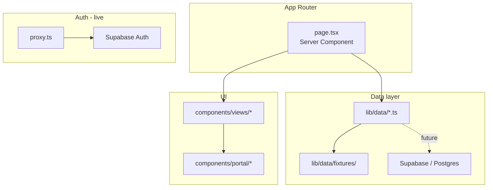

# Amakai

Monorepo for the Amakai marketing site and client portal — two separate Next.js apps that share UI and configuration.

## Structure

```
apps/
  landing/          Marketing site (amakai.com)
  portal/           Client portal (portal.amakai.com)
    app/              Next.js App Router routes
    components/
      views/          Presentational page UI (no data fetching)
      design/         Workflow editor, canvas, and design hub UI
      portal/         Shared portal widgets (metrics, status badges, …)
      auth/           Sign-in / sign-up
    lib/
      domain/         TypeScript domain types (API contract)
      data/           Async data accessors ← backend swap point
        fixtures/     Mock data (delete imports when Supabase is live)
      design/         Workflow canvas layout, graph helpers, editor types
      actions/        Server Actions (workflow save, deploy, delete)
      auth/           Auth helpers
    hooks/            Client hooks (editor state, auto-save, viewport)
    utils/supabase/   Supabase browser/server clients + session proxy
packages/
  shared/           UI components, theme, and cross-app config
SDLC.md             Product requirements and system architecture
```

## Scripts

From the repo root:

- `npm run dev:landing` — landing site at [http://localhost:3000](http://localhost:3000)
- `npm run dev:portal` — portal at [http://localhost:3001](http://localhost:3001)
- `npm run build:landing` / `npm run build:portal` — production builds
- `npm run lint` — lint all workspaces

Run both apps in separate terminals during local development.

## Environment

Copy [apps/portal/.env.example](apps/portal/.env.example) to `apps/portal/.env.local` and fill in Supabase keys. The portal proxy requires env vars in the **app directory**, not only the repo root.

| Variable | App | Purpose |
|----------|-----|---------|
| `NEXT_PUBLIC_SUPABASE_URL` | Portal | Supabase project URL |
| `NEXT_PUBLIC_SUPABASE_PUBLISHABLE_KEY` | Portal | Browser-safe API key |
| `SUPABASE_SECRET_KEY` | Portal | Server-only admin tasks (optional until needed) |
| `NEXT_PUBLIC_SITE_URL` | Each app | Public URL of that deploy |
| `NEXT_PUBLIC_LANDING_URL` | Both | Cross-link to marketing site |
| `NEXT_PUBLIC_PORTAL_URL` | Both | Cross-link to portal |

See [.env.example](.env.example) for auth redirect URL notes. Do not commit `.env` or `.env.local`.

## Deployment

Deploy each app as its own project (e.g. two Vercel projects from the same repo):

| App | Root directory | Example domain |
|-----|----------------|----------------|
| Landing | `apps/landing` | `https://amakai.com` |
| Portal | `apps/portal` | `https://portal.amakai.com` |

Local dev defaults to `localhost:3000` (landing) and `localhost:3001` (portal) via `NEXT_PUBLIC_APP` in each app's `next.config.ts`. Both apps load env from the monorepo root via `loadEnvConfig` in `next.config.ts`, but **portal auth also requires** `apps/portal/.env.local`.

---

## Portal architecture (frontend)

The portal is built **frontend-first**: pages render real UI with fixture data. Backend work replaces fixture returns inside `apps/portal/lib/data/*.ts` without touching views or pages.



### Layer rules

| Layer | Location | Responsibility |
|-------|----------|----------------|
| **Domain** | `lib/domain/` | Pure types shared by accessors and views. No React, no Supabase. |
| **Data** | `lib/data/` | Async functions pages call. **Only layer that talks to fixtures or DB.** |
| **Fixtures** | `lib/data/fixtures/` | Static mock data. Removed from imports when backend is live. |
| **Pages** | `app/(app)/**/page.tsx` | Fetch via data accessors, pass props to views. Stay thin. |
| **Views** | `components/views/` | Presentational. Client components only for local UI state (filters). |
| **Auth** | `utils/supabase/`, `proxy.ts` | Session refresh and OAuth — **already wired to Supabase.** |

Detailed data-layer docs: [apps/portal/lib/data/README.md](apps/portal/lib/data/README.md).

### Design / workflow editor

The workflow editor is a full-screen canvas with floating toolbars and sheet panels (components, templates, AI builder). Draft workflows persist to Supabase when the user is signed in.

| Route | Purpose |
|-------|---------|
| `/design/workflows` | List, create, and delete workflows |
| `/design/workflow-editor?id=<uuid>` | Canvas editor (requires saved workflow id) |

Editor URL params: `?panel=components|templates|ai` opens the resources or AI sheet on load.

Key modules:

| Area | Location |
|------|----------|
| Editor shell | `components/design/design-hub-view.tsx` |
| Canvas | `components/design/workflow-node-graph.tsx` |
| Client state + undo | `hooks/use-design-hub-state.ts` |
| Auto-save | `hooks/use-workflow-auto-save.ts` |
| Graph helpers | `lib/design/workflow-graph.ts`, `layout-utils.ts`, `canvas-viewport.ts` |
| Mutations | `lib/actions/workflow-actions.ts` |
| DB access | `lib/data/workflows.ts` |

Apply migration `supabase/migrations/20260730183000_workflows_and_deploy.sql` before using save/deploy in production (Supabase SQL Editor if CLI Docker is unavailable).

### Implemented vs stub pages

| Section | Status | Routes |
|---------|--------|--------|
| Dashboard | UI + fixtures | `/` |
| Design | Workflows + editor (Supabase drafts) | `/design/workflows`, `/design/workflow-editor?id=` |
| Deploy | UI + fixtures | `/deploy/*` |
| Operate | UI + fixtures | `/operate/*` |
| Optimize | Stub (`SectionPage`) | `/optimize/*` |
| Resources | Stub | `/resources/*` |
| Admin | Stub | `/admin/*` |
| Community, Settings | Stub | `/community`, `/settings` |
| Auth | Live (Supabase) | `/login`, `/signup`, `/auth/callback` |

Requirements map to [SDLC.md](SDLC.md) section 3 (Requirements Engineering).

---

## Backend implementation guide (for AI agents)

When adding a real backend, follow this order. **Do not refactor views or pages unless the domain model changes.**

### 1. Auth (done)

- Supabase Auth with Google, GitHub, and email/password
- Session proxy: [apps/portal/proxy.ts](apps/portal/proxy.ts)
- Clients: [apps/portal/utils/supabase/](apps/portal/utils/supabase/)
- Username stored in `user_metadata.username` at sign-up ([apps/portal/lib/auth/user.ts](apps/portal/lib/auth/user.ts))

### 2. Database schema

Design Postgres tables in Supabase aligned with `lib/domain/*` types and SDLC section 4 (Domain Analysis). Suggested core entities:

- `organizations`, `organization_members` — multi-tenant isolation
- `workflows`, `workflow_nodes`, `workflow_versions` — design + deploy
- `environments`, `releases` — deployment (SDLC 3.1.5)
- `executions`, `execution_logs` — operate (SDLC 3.1.6, 10)
- `alerts`, `components`, `templates` — resources and monitoring

Use migrations via Supabase CLI. Enable **RLS on every exposed table**. Scope policies with `organization_id` and `auth.uid()` — never trust `user_metadata` for authorization (use `app_metadata` or membership tables).

### 3. Replace fixtures in data accessors

For each file in `apps/portal/lib/data/`:

1. Keep the exported function signatures and return types unchanged.
2. Replace `return fixture` with a Supabase query using `createClient()` from `@/utils/supabase/server`.
3. Map DB rows (snake_case) to domain types (camelCase) in the accessor.
4. Leave fixtures in place until the query is verified; then stop importing them.

Example accessor swap — see [apps/portal/lib/data/README.md](apps/portal/lib/data/README.md).

### 4. Mutations (partial)

Workflow drafts use Server Actions in `lib/actions/workflow-actions.ts` (save, create, delete, deploy). Other sections still expose disabled buttons until mutations exist:

- Prefer **Server Actions** colocated with the route or in `lib/actions/`
- Call Supabase from the server client; revalidate paths after success
- Do not add fake `onClick` handlers in views

### 5. Realtime and polling

Dashboard and monitoring pages are server-rendered with static fixture snapshots. For live updates:

- Option A: Supabase Realtime subscriptions in a thin client wrapper around the metric section
- Option B: Route segment revalidation or polling via `revalidatePath`

Keep the data accessor as the source of truth; realtime handlers should call the same mappers.

### 6. AI / workflow engine (future)

SDLC sections 7–10 describe services (AI Planning Engine, Workflow Engine, Validation Engine) that are **not** in this repo yet. The portal UI anticipates their outputs via domain types in `lib/domain/planning.ts`, `workflow.ts`, and `validation.ts`. When those services exist:

- Expose them via API routes or Edge Functions
- Data accessors call those endpoints instead of Supabase tables where appropriate
- Do not embed AI logic in React components

### 7. Verification checklist

After wiring a domain to Supabase:

- [ ] RLS policies tested for `anon`, `authenticated`, and cross-tenant access
- [ ] Data accessor returns match existing domain types (pages unchanged)
- [ ] `npm run build:portal` passes
- [ ] Auth proxy still refreshes sessions on protected routes

### Agent constraints

- Read [SDLC.md](SDLC.md) and [apps/portal/lib/data/README.md](apps/portal/lib/data/README.md) before changing portal data flow.
- Read Next.js guides in `node_modules/next/dist/docs/` — this project uses Next.js 16 (`proxy.ts`, not `middleware.ts`).
- Shared UI lives in `packages/shared`; portal-specific UI in `apps/portal/components/`.
- Minimize scope: one data accessor or one domain at a time; do not rewrite all views in one pass.
