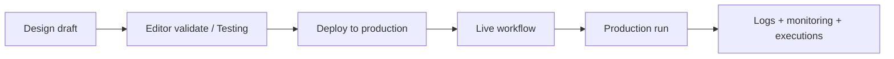

# Portal guide

Operational reference for the Amakai client portal (`apps/portal`). For product requirements see [SDLC.md](./SDLC.md). For workflow node types see [Workflow_Nodes_Reference.md](./Workflow_Nodes_Reference.md).

## Navigation

| Section | Routes | Purpose |
|---------|--------|---------|
| **Dashboard** | `/` | Live workflows, recent production runs |
| **Production** | `/production/runs`, `/production/history` | Execute deployed workflows; view run history |
| **Design** | `/design/workflows`, `/design/workflow-editor`, `/design/tables`, `/design/testing` | Author workflows and tables; test drafts in playground |
| **Operate** | `/operate/live-workflows`, `/operate/logs` | Monitor live workflows; grouped execution logs |
| **Resources** | `/resources/secrets` | Encrypted secrets vault + Connect Gmail / Outlook OAuth |
| **Community** | `/community` | Stub |
| **Administration** | `/admin/billing`, `/settings` | Billing (Free/Pro Checkout); Settings (profile + Stripe portal manage/unsubscribe) |

Legacy redirects (bookmarks):

| Old path | Redirects to |
|----------|--------------|
| `/deploy/*` | `/operate/live-workflows` |
| `/operate/alerts` | `/operate/logs?filter=alerts` |
| `/operate/monitoring` | `/operate/live-workflows` |
| `/operate/executions` | `/operate/live-workflows` |
| `/admin/billing/pro` | `/admin/billing` |

## Billing (Stripe)

| Surface | Route | Behavior |
|---------|-------|----------|
| **Plans / upgrade** | `/admin/billing` | Free vs Pro; Upgrade opens Stripe Checkout |
| **Manage / cancel** | `/settings` → Billing | Opens Stripe Customer Portal in a new tab |
| **Webhook** | `POST /api/stripe/webhook` | Sole Stripe → Amakai ingress; signature required in every env |

Entitlements:

- Plan is **never** set from the browser. Only the Stripe gateway writes plan after verified Checkout/webhook sync.
- Pro requires an **active/trialing** subscription that includes `STRIPE_PRO_PRICE_ID`.
- Cancel-at-period-end keeps Pro until the period ends; UI shows **Active until &lt;date&gt;** (not “renews”).
- After Checkout return, Billing auto-refreshes until Pro syncs, then shows congratulations.
- Authenticated users have **read-only** RLS on `user_billing_profiles`; Stripe IDs are AES-GCM encrypted at rest (`SECRETS_ENCRYPTION_KEY`).
- All Stripe SDK usage lives in `lib/stripe/gateway.ts` only.

## Workflow lifecycle

### Design

- **Drafts** live in Supabase `workflows` (status `draft`).
- **Testing** (`/design/testing`) runs the in-process playground against draft graphs with manual trigger payloads and approval/wait simulation.
- **Validate** in the editor runs the same playground engine before deploy.
- **Auto-save** validates names and field lengths via Zod (`lib/validation/`). Incomplete integration nodes are allowed on drafts; stricter checks apply at playground run time.

### Input validation

Shared limits live in `lib/validation/limits.ts` (Zod schemas in `lib/validation/*`):

| Area | Limit |
|------|--------|
| Workflow / table / secret names | 30 characters; letters, numbers, spaces, `. - _ ( ) &` |
| Table columns | Up to 50; keys are snake_case |
| Trigger output field names | Up to 20 fields, 64 chars each (identifier pattern) |
| Node config strings | Per-field caps (code, compare values, emails, etc.) |

OAuth connect auto-names secrets from the mailbox local part (e.g. `Gmail abdullahrazi60`); the full address is stored in secret metadata.

### Triggers: testing vs live

| Trigger | Testing / Validate | Live (after deploy) |
|---------|-------------------|---------------------|
| **Trigger** (`trigger.workflow`) | Simulated — enter payload or use samples | Manual only via **Production → Runs** |
| **API Trigger** (`trigger.api`) | Simulated — same as above | **Webhook:** `POST /api/webhooks/{token}` auto-starts runs (URL in Operate). **Schedule / signal:** UI only — not auto-fired yet |
| **External Tool Trigger** (email receive) | Simulated sample email | Inbound Gmail/Outlook push auto-starts runs |

Use **API Trigger** (not generic Trigger) for real inbound HTTP webhooks.

### Deploy

- Single production target — no environment picker or version UI.
- Deploy from the workflow editor; overwrites the live graph (`workflow_versions.version = 'live'`).
- Published workflows appear under **Operate → Live Workflows** and on the dashboard.
- Deploy also registers **trigger subscriptions** (webhook tokens, Gmail watch / Outlook Graph subscriptions when configured).

### Integrations setup

1. Apply migration `20260803190000_secrets_and_triggers.sql`.
2. Set `SECRETS_ENCRYPTION_KEY` (or `SUPABASE_SECRET_KEY`) and OAuth client env vars — see `apps/portal/.env.example` (optional unless using Gmail/Outlook connect).
3. Connect Gmail / Outlook under **Resources → Secrets** (each user connects their own mailbox; env vars are app credentials only).
4. Add **External Tool Trigger / External Tool / API Trigger / HTTP Request** nodes from the Integrations palette.
5. Deploy; copy the webhook URL from Operate for **API Trigger** workflows.
6. For Gmail receive, configure Pub/Sub push to `/api/integrations/gmail/push` and set `GMAIL_PUBSUB_TOPIC`.
7. Optional queue worker: `POST /api/internal/process-queue` (protect with `CRON_SECRET`).

### Production runs

- **Production → Runs**: select a live workflow, enter trigger field values (or custom JSON), run in production.
- Each run creates a row in `workflow_executions` with status, duration, trigger input, and step logs in `result` JSON.
- Inbound webhooks/email enqueue runs (`queued` → `running`) via `lib/data/inbound-runs.ts`.
- **Retention**: only the **20 most recent runs per workflow** are kept; older rows are deleted automatically.

### Operate

Per live workflow (`/operate/live-workflows/[id]/…`):

| Tab | Shows |
|-----|--------|
| **Monitoring** | Metrics derived from production runs (success rate, trigger latency, node health, graph-adaptive sections) |
| **Executions** | Run list with trigger input summary; expand or open detail sheet |

Global:

| Page | Shows |
|------|--------|
| **Logs** | One row per execution (batched); filters for level/alerts; detail sheet with steps + log lines |
| **Notification bell** | Warn/error alerts grouped by execution |

Alerts are not a separate nav item — they filter logs and the bell.

## Execution engine (current)

Production and testing share `lib/engine/playground.ts`:

- Graph traversal, triggers, approvals, waits, loops, parallel branches
- Playground adds sample payloads when trigger fields are omitted; production runs use user-supplied trigger input
- Not a separate distributed workflow engine yet (see SDLC §7–10)

## Key files

| Area | Location |
|------|----------|
| Nav + breadcrumbs | `lib/navigation.ts` |
| Production runs | `lib/data/production-runs.ts`, `lib/actions/production-actions.ts` |
| Logs + insights | `lib/data/logs.ts`, `lib/operate/production-execution-insights.ts` |
| Monitoring profile | `lib/operate/workflow-monitoring-profile.ts` |
| Deploy / live list | `lib/data/deployments.ts` |
| Secrets | `lib/data/secrets.ts`, `lib/actions/secret-actions.ts` |
| Integration registry | `lib/integrations/registry/` |
| Email adapters | `lib/integrations/email/adapters.ts` |
| Inbound runs / webhooks | `lib/data/inbound-runs.ts`, `app/api/webhooks/[token]/route.ts` |
| Input validation (Zod) | `lib/validation/` |
| Billing / plans | `lib/stripe/gateway.ts` (sole Stripe SDK entry), `lib/data/billing.ts`, `components/billing/`, `app/api/stripe/webhook` |
| Editor | `components/design/design-hub-view.tsx` |
| Views | `components/views/*` |

## Local setup

1. Copy `apps/portal/.env.example` → `apps/portal/.env.local` (Supabase keys; optional Stripe keys for billing).
2. Apply Supabase migrations (see [data layer README](../apps/portal/lib/data/README.md)).
3. `npm run dev:portal` → [http://localhost:3001](http://localhost:3001)
4. Optional Stripe:
   - Set `STRIPE_SECRET_KEY`, `STRIPE_WEBHOOK_SECRET`, and `SECRETS_ENCRYPTION_KEY` (encrypts Stripe IDs at rest).
   - Enable **Customer Portal** in the Stripe Dashboard.
   - Forward webhooks: `stripe listen --forward-to localhost:3001/api/stripe/webhook` (signature verification is required even in local/dev — never bypass it).
   - All Stripe API access goes through `lib/stripe/gateway.ts` only. Plan upgrades require a verified webhook/reconcile with the configured `STRIPE_PRO_PRICE_ID`; clients cannot set plan via the Data API (read-only RLS).

## Agent notes

- Read Next.js docs in `node_modules/next/dist/docs/` (Next.js 16; `proxy.ts` not `middleware.ts`).
- Portal data accessors: [apps/portal/lib/data/README.md](../apps/portal/lib/data/README.md).
- Minimize scope: one accessor or route at a time; keep views presentational.
